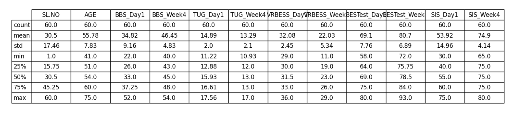
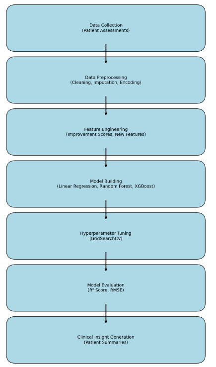
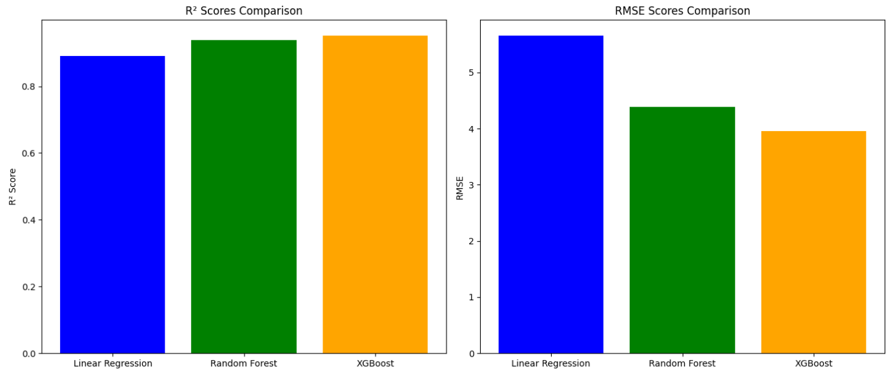

# MSc Data Science Final Project

## Project Title
Recovery Outcome Analysis Using Patient Rehabilitation Assessment Scores

## Author
R. Meda (Student ID: 23005003)

## Supervisor
William Alston

## Description
This project applies machine learning techniques to predict patient rehabilitation outcomes based on Day 1 assessments. It compares Linear Regression, Random Forest, and XGBoost models, selects the best model, and generates patient recovery summaries.

## Technologies Used
- Python 3.10
- Pandas
- NumPy
- Scikit-learn
- XGBoost
- Matplotlib
- Seaborn

## Dataset
- Patient Master Chart.xlsx

## How to Run
1. Download this repository.
2. Install required libraries using:
3. Open and run `Final-Project-Notebook.ipynb` in Jupyter Notebook or VS Code.
4. Follow the notebook to reproduce the analysis, modeling, and results.

## Visualizations and Figures

# Visualizations and Figures

## Patient Data Sample

## Project Methodology Flowchart

## Model Performance Comparison

## Acknowledgements
- University of Hertfordshire MSc Data Science Programme
- Supervisor: William Alston

## License
This project is intended for academic use only.

